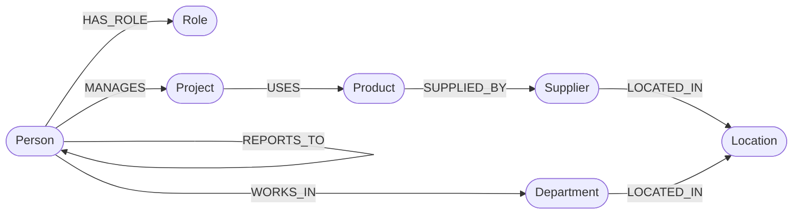

# org-graph

A small web application backed by a **graph database** (CognoDB), exploring an organisation's reporting structure alongside its supply chain. Built for the WEXA AI take-home assignment.

- **Use case:** Org chart + supply chain (people, departments, projects, products, suppliers, locations)
- **Stack:** TypeScript (strict) · Node.js · Express · React · Tailwind · shadcn/ui · @tanstack/react-query · axios · neo4j-driver
- **Database:** CognoDB (managed graph DB, openCypher over Bolt)

---

## 1. Use case

Most business data lives in rows and joins — but the interesting questions in an org-and-supply-chain context are about **connections**: *who ultimately reports to the CEO?*, *which projects depend on a supplier in region X?*, *how are two employees connected through their managers?*

A graph database answers these directly with variable-length path traversals, where a relational schema would force recursive CTEs or repeated self-joins.

This app lets a non-technical user explore that graph through:

- A **dashboard** with counts and a per-region supplier breakdown
- **People, Departments, Projects, Products, Suppliers, Locations** browse pages with list + detail views and cross-links
- A **Graph Explorer** that runs read-only Cypher queries against the graph
- A **global search API** across all node labels (powering search across the app)

---

## 2. Why a graph database?

This use case fits a graph DB for three concrete reasons:

1. **Variable-length reporting chains.** "Find everyone who ultimately reports up to the CEO" is `MATCH (p:Person)-[:REPORTS_TO*]->(c:Person {title: "CEO"}) RETURN p` — one line. In SQL this is a recursive CTE that's brittle and hard to parameterise.
2. **Multi-domain joins without a schema rewrite.** Org + supply relationships cross-cut `people`, `products`, and `suppliers`. A graph lets new relationship types be added without altering a rigid table schema.
3. **Path-shaped questions.** "Shortest reporting path between two employees" is a first-class graph query — in SQL it's awkward self-joins over an `employees.manager_id` column.

---

## 3. Data model



### Nodes

| Label | Properties |
|---|---|
| `Person` | `id`, `name`, `email`, `title`, `joinedAt` |
| `Department` | `id`, `name`, `costCenter` |
| `Role` | `id`, `level` (IC / Manager / Director / VP / C-level) |
| `Project` | `id`, `name`, `status` (planned / active / done) |
| `Product` | `id`, `sku`, `name`, `category` |
| `Supplier` | `id`, `name`, `rating` |
| `Location` | `id`, `city`, `country`, `region` |

### Relationships

- `(:Person)-[:REPORTS_TO]->(:Person)`
- `(:Person)-[:WORKS_IN]->(:Department)`
- `(:Person)-[:HAS_ROLE]->(:Role)`
- `(:Person)-[:MANAGES]->(:Project)`
- `(:Project)-[:USES]->(:Product)`
- `(:Product)-[:SUPPLIED_BY]->(:Supplier)`
- `(:Supplier)-[:LOCATED_IN]->(:Location)`
- `(:Department)-[:LOCATED_IN]->(:Location)`

---

## 4. Tech stack

**Backend** — Node.js · Express · TypeScript (strict + `noUncheckedIndexedAccess`, `exactOptionalPropertyTypes`) · `neo4j-driver` · Bolt 5.x · openCypher

**Frontend** — React (Vite) · TypeScript (strict + extras) · Tailwind CSS · hand-written shadcn/ui primitives · @tanstack/react-query · axios · react-router-dom

**Tooling** — pnpm workspaces · `tsx` for backend dev/runtime

---

## 5. Project structure

```
org-graph/
├── backend/                      # Express + neo4j-driver API
│   ├── src/
│   │   ├── server.ts             # Express bootstrap + route wiring
│   │   ├── db/driver.ts          # neo4j-driver singleton
│   │   ├── routes/               # one router per resource + dashboard + query
│   │   └── lib/                  # pagination + read-only Cypher guard
│   ├── scripts/
│   │   ├── seed.ts               # wipes + loads seed data
│   │   ├── wipe.ts               # DETACH DELETE the whole graph
│   │   └── data.ts               # deterministic seed fixtures
│   └── package.json
├── frontend/                     # React SPA (Vite)
│   ├── src/
│   │   ├── components/
│   │   │   ├── ui/               # hand-written shadcn primitives
│   │   │   ├── common/           # shared building blocks (DataTable, Pagination, ...)
│   │   │   └── layout/           # AppLayout + NavBar
│   │   ├── pages/                # 14 routed pages
│   │   ├── hooks/                # react-query hooks
│   │   ├── lib/                  # format, list-state, detail-hooks
│   │   ├── api/client.ts         # axios instance
│   │   ├── App.tsx               # router + routes
│   │   └── main.tsx              # QueryClientProvider + bootstrap
│   └── package.json
├── packages/
│   └── shared-types/             # API request/response types shared by both layers
├── README.md
├── pnpm-workspace.yaml
└── package.json                  # workspace root
```

---

## 6. Setup & run

### 6.1 Prerequisites

- **Node.js** 20+ (LTS recommended)
- **pnpm** 9+ (`npm i -g pnpm`)
- A **CognoDB Cloud** account (free tier is enough)

### 6.2 Create the CognoDB instance

1. Sign up at <https://console.cognodb.com/signup>. Free tier, no credit card.
2. From the console, create a free instance and pick a region. Provisions in under a minute.
3. Save the connection URI of the form `bolt+s://<instance-id>.databases.cognodb.com` and the generated password for the user `cognodb`. The password is shown **exactly once** — copy it immediately.

### 6.3 Clone & install

```bash
git clone https://github.com/<your-username>/org-graph.git
cd org-graph
pnpm install
```

### 6.4 Configure environment variables

Copy the templates and fill in real values. **Never commit `backend/.env`** — it's in `.gitignore`.

```bash
cp backend/.env.example backend/.env
cp frontend/.env.example frontend/.env
```

Edit `backend/.env`:

```bash
COGNODB_URI=bolt+s://<instance-id>.databases.cognodb.com
COGNODB_USER=cognodb
COGNODB_PASSWORD=<your-saved-password>
PORT=3000
```

### 6.5 Load seed data

```bash
pnpm seed
```

This wipes any existing data and loads: 1 CEO + 2 VPs + 5 Directors + 10 Managers + 32 ICs (50 people), 10 departments, 30 projects, 40 products, 20 suppliers, 15 locations, plus all 8 relationship types. The seed is deterministic — re-running produces the same graph.

To wipe without reseeding: `pnpm wipe`.

### 6.6 Start dev servers

```bash
pnpm dev
```

This starts the backend (port 3000) and the frontend Vite dev server (port 5173, proxies `/api` to the backend) in parallel. Open <http://localhost:5173>.

To run them separately:

```bash
pnpm --filter @org-graph/backend dev
pnpm --filter @org-graph/frontend dev
```

---

## 7. API

All endpoints live under `/api`. All list endpoints accept `page`, `pageSize`, and per-resource `sort` + `order` query params (whitelisted fields, never interpolated into Cypher).

| Method | Path | Purpose |
|---|---|---|
| GET | `/api/health` | DB connection status + node count |
| GET | `/api/dashboard` | Aggregate counts + suppliers per region |
| GET | `/api/search?q=<term>` | Global cross-label search (min 2 chars) |
| GET | `/api/people` · `/api/people/:id` | List + detail |
| GET | `/api/people/:id/reports-chain?to=<id>` | Shortest path via `REPORTS_TO` (multi-hop) |
| GET | `/api/departments` · `/api/departments/:id` | List + detail |
| GET | `/api/projects` · `/api/projects/:id` | List + detail; `?status=active\|planned\|done` |
| GET | `/api/products` · `/api/products/:id` | List + detail |
| GET | `/api/suppliers` · `/api/suppliers/:id` | List + detail |
| GET | `/api/locations` | List (no detail view) |
| POST | `/api/query` | Run arbitrary read-only Cypher (`{ cypher, params }`) |

The `/api/query` endpoint runs a guard that strips comments and rejects any query containing `CREATE`, `MERGE`, `DELETE`, `DETACH`, `SET`, `REMOVE`, `DROP`, `ALTER`, `GRANT`, `REVOKE`, `CALL dbms`, `CALL db.`, `LOAD CSV`, or `USING PERIODIC`. Queries must contain `MATCH` and `RETURN`.

---

## 8. UI pages

| Path | Page | Purpose |
|---|---|---|
| `/` | Dashboard | Aggregate counts + suppliers per region |
| `/people` · `/people/:id` | People | Searchable list; detail with profile, manager, direct reports, projects, and a "find reports chain" multi-hop picker |
| `/departments` · `/departments/:id` | Departments | People + projects per dept, with location |
| `/projects` · `/projects/:id` | Projects | Status filter; detail with managers, dept, products |
| `/products` · `/products/:id` | Products | Suppliers + projects |
| `/suppliers` · `/suppliers/:id` | Suppliers | Products + location |
| `/locations` | Locations | List only |
| `/explorer` | Graph Explorer | Read-only Cypher runner with 5 preset queries |
| any other path | 404 | Catch-all |

UI uses hand-written shadcn/ui primitives with explicit **loading** (Skeleton), **empty** (EmptyState), and **error** (Alert) states. The nav bar shows a live DB connection indicator that polls `/api/health` every 10 seconds.
